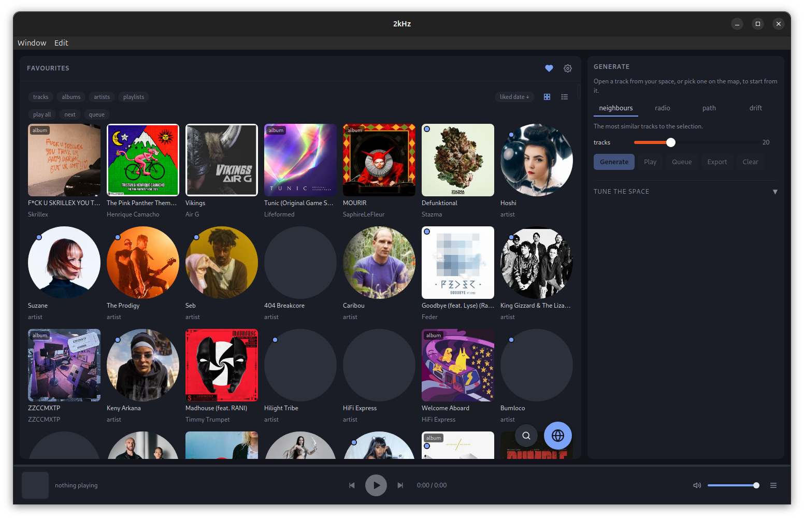
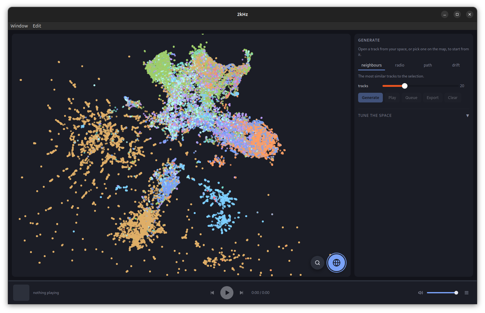
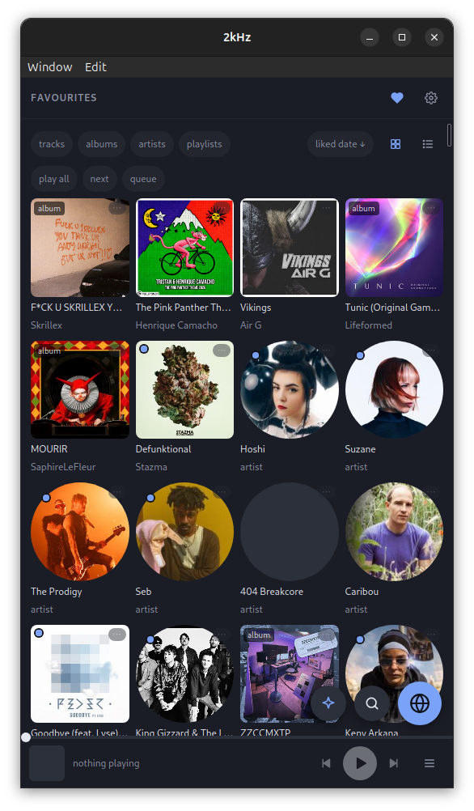

# 2kHz

Music as a navigable space. Every track becomes a point in ~80 dimensions where
distance approximates perceptual similarity, so recommendation becomes geometry:
the nearest neighbours of a track, a path that morphs from A to B, or a drift in
a direction you describe in words.

Qobuz's API returns metadata only (no BPM, no key, no energy), so the acoustic
half of every vector is computed from the audio itself.



Your favourites in the main area, the generate panel always on the right, and
the player along the bottom. The two round buttons open search and the map.



The map: a UMAP projection of every analysed track, coloured by genre, over
the main area while the generate panel stays beside it.



On a narrow screen the generate panel slides in from the right over the main
area, from its own floating button.

## Shape of the system

Two programs, one of each side of a socket.

```
  two-khz-server                               two-khz-app (desktop, Android)
  ──────────────                               ──────────────────────────────
  Qobuz credentials, ONE 2/s rate limit        syncs space.bin + catalog.db
  crawl       favourites → similar artists     neighbours · radio · path · drift
  analyse     middle 90s of each track           → in process, live sliders
                → CLAP (ONNX) + descriptors    map, library, playback
  build-space features → space.bin/json                  │
  layout      UMAP → map coordinates                     │
  embed       CLAP text tower                  plays the signed stream URL
         │                                               ▲
         └── /api/… + SSE for stage output ──────────────┘
                     audio never proxies
```

The server is one Rust binary: the API, the crawl and the whole analysis
pipeline, with CLAP running in ONNX Runtime. The apps are clients of it and
nothing else, there is no local mode, so a desktop on its own runs the server
beside it and pairs with it like any other device.

The space is synced, not queried: a neighbour lookup is microseconds, so routing
a weight slider through a socket would cost the one property the space was built
for. Only `embed` crosses the wire. Clients get `catalog.db`, a projection of the
corpus down to what navigation reads, **269MB → 39MB**.

Design notes, measurements and the space layout are in
[docs/design.md](docs/design.md).

## Setup

A Rust toolchain. The server needs nothing else; it fetches the CLAP weights
(~620MB, into `data/models/`) the first time a stage needs them, or up front:

```sh
cd server
cargo run --release -- models
```

The desktop app draws into a system webview, so on Linux it also wants GTK and
webkit headers at build time, without them the build stops at `glib-sys` with
`glib-2.0 was not found in the pkg-config search path`. `libwebkit2gtk-4.1` is
what wry links against; `libxdo` and the appindicator arrive via tao and
tray-icon:

```sh
sudo apt install build-essential pkg-config libwebkit2gtk-4.1-dev \
  libgtk-3-dev libsoup-3.0-dev libxdo-dev libayatana-appindicator3-dev \
  librsvg2-dev libssl-dev
```

The server needs none of it: it takes the app crate with default features off,
which keeps dioxus, wry and GTK out.

### Credentials

Qobuz does not issue API credentials to individuals, and since April 2026 its
API no longer serves anonymous requests, so sign-in has to happen in a browser:

```sh
cd server
cargo run --release -- login
```

That scrapes the current app id and signing secrets from the web player, opens
your browser to Qobuz, and writes all three into `.env` at the repo root (or
into `TWO_KHZ_ENV_DIR`).

If the browser round-trip is awkward (a headless box, a container), log in at
<https://play.qobuz.com/>, open devtools → Application → Local Storage →
`play.qobuz.com`, copy the `localuser.token` value, and set:

```sh
QOBUZ_USER_AUTH_TOKEN=<the token>
```

Tokens expire when the session ends. The app id and secrets rotate with web
player releases; `refresh-credentials --write` re-scrapes those alone.

## Running the pipeline

Every stage is a subcommand of the server, and also a button in the app's
**Pipeline** view, which runs the same code in the server's process.

```sh
cd server
cargo run --release -- whoami                   # verify credentials
cargo run --release -- crawl --max-tracks 2000  # favourites, then similar artists
cargo run --release -- analyse                  # fetch excerpts, extract features
cargo run --release -- build-space              # assemble vectors
cargo run --release -- layout                   # UMAP projection for the map
cargo run --release -- evaluate                 # space sanity check
cargo run --release -- status                   # what is done, what is due
```

Every stage is resumable: the crawl frontier lives in SQLite and analysis skips
what it has already done, so Ctrl-C and rerun is always safe.

To skip the queue for one thing, `analyse --track ID`, `--album ID` or
`--artist ID` catalogues it first if need be and analyses only that. In the
app, **Add to space** on a track, album or artist page does the same, then
rebuilds the space and the map. A backlog `analyse` already running pauses
for it and picks up where it was afterwards.

`analyse` stores the CLAP embedding and the descriptors and nothing derived, so
the mood and style scores, the weights and the PCA are all rebuilt by
`build-space` in seconds, change a label in `server/src/pipeline/labels.rs`
and rebuild, no re-analysis.

### Crawling

Seeds from your favourites, then expands outward through
`artist/getSimilarArtists`.

```sh
two-khz-server crawl --max-tracks 5000   # favourites, then similar
two-khz-server crawl --no-seed           # resume the frontier only
two-khz-server crawl --artist 43840      # one discography, queued
two-khz-server crawl --album 0634904077969
```

Requests are limited to 2/s with retry-and-backoff on 429s, one account pays
for every call, and the crawl, `analyse` and every client's browsing share that
one budget, so browsing during a crawl is slower, not blocked.

## Running the app

Start the server, pair a device, and point the app at it:

```sh
cd server
cargo run --release -- pair --name desktop --scope pipeline   # prints a token, once
cargo run --release -- serve                                  # 127.0.0.1:7700

cd app
TWO_KHZ_SERVER=http://127.0.0.1:7700 TWO_KHZ_TOKEN=<token> cargo run --release
```

Without those two variables the app opens on a setup screen that asks for the
address and token once and remembers them.

Two views, switched from the header, over a transport bar that stays put.

**Explore** is three columns: Qobuz live on the left, the map in the middle, the
analysed space on the right. Clicking a track plays it and makes the list you
clicked in the queue. **in space** selects an analysed track on the map;
**fetch** pulls an album's tracklist, or an artist's discography, into the
catalogue.

Generation is one panel with four modes:

| mode | what it does |
|---|---|
| neighbours | the *k* most similar tracks; follows the selection as you browse |
| radio | a greedy walk, each jump to the nearest track not yet played |
| path | A to B, either the shortest route or an evenly paced interpolation |
| drift | away from the selection, towards a phrase |

Radio has an *artist pull* slider, which stops a walk sitting inside one
discography. Map positions are fixed until `layout` is re-run, the weight
sliders change which tracks are near each other, not where the dots sit.

**Pipeline** runs the four stages on the server and streams their output into a
log. A stage started from a client **outlives that client**, start `analyse`
from a phone and walk away, so **stop** is the only thing that ends one early.

**Playback** offers MP3 320, FLAC 16/44 or FLAC hi-res, streamed from Qobuz
straight to the device.

To try the app without Qobuz, build a synthetic corpus, eight fake albums run
through the real pipeline, and serve that:

```sh
cd server
cargo run --release -- demo /tmp/two-khz-demo
TWO_KHZ_DATA_DIR=/tmp/two-khz-demo/data cargo run --release -- pair --name demo --scope pipeline
TWO_KHZ_DATA_DIR=/tmp/two-khz-demo/data cargo run --release -- serve
```

## Hiding an artist

`blocked_artists` is a table everything honours: the pipeline will not crawl
them, follow them to their similar artists, analyse their tracks or place them
in the space, and the app hides what is already stored and refuses to play it.

```sh
two-khz-server block "artist name"       # or an artist id
two-khz-server block 224109 --reason "why"
two-khz-server blocked                   # list
two-khz-server unblock 224109
```

Or click **hide** on any artist or track in the app. The **Hidden** panel at the
bottom of the Qobuz column lists them with a way back.

Hiding filters rather than deletes, which is what lets a block take effect
immediately and be undone. `block --purge` deletes the tracks, features and
albums instead; re-run `build-space` and `layout` afterwards.

The match is on `artists.id`, so a featured credit that Qobuz files under a
different artist id can still surface, block those ids too. An ambiguous name
refuses to act rather than guessing.

## Devices and the network

Two scopes, both authenticated: `play` is browsing, syncing and minting a stream
URL, and **Add to space**, which is bounded; `pipeline` is crawling and
analysing the whole backlog. Each device gets its own token, stored
only as a SHA-256 hash, so one phone can be revoked without re-pairing the rest.

The devices share one queue. The speaker button in the player bar lists the
ones connected, under the name they were paired with, and picks which one
plays; the others become remotes for it.

```sh
two-khz-server pair --name phone --scope play
two-khz-server devices
two-khz-server revoke 3
```

This speaks plain HTTP and binds to loopback. Anything beyond loopback belongs
behind WireGuard/Tailscale or a TLS proxy.

## Docker

The server ships as one image, so the machine that hosts it needs no Rust
toolchain.

```sh
docker run -d --init --name two-khz -p 127.0.0.1:7700:7700 \
  -v two-khz-data:/data --env-file .env 4gjr3z1t/2khz:<version>

docker exec two-khz two-khz-server pair --name phone --scope play
```

[`compose.yaml`](compose.yaml) is the worked version, pairing, the slim
catalogue, the volumes and the loopback-only port mapping.

The image carries the API and the whole pipeline; the CLAP weights are fetched
into the `/data` volume on first use (`docker exec two-khz two-khz-server
models` to do it up front). It is published to Docker Hub and GHCR with a
version tag and `:latest`, but everything here pins a version, so that pulling
never silently changes the server underneath a corpus that took hours to build.
`docker build .` reproduces it when you need to run uncommitted changes.

The container binds `0.0.0.0` and publishes to `127.0.0.1`, which keeps the
loopback property above: the bind has to be `0.0.0.0` to be reachable across
the container boundary at all, so it is the *published* port that is
restricted.

Credentials never enter the image, `.env` is in `.dockerignore`, and they
come in as environment variables. The corpus, the space, the device tokens, the
model weights and any `.env` that `login` writes all live in the `/data`
volume, which is the only thing here worth a backup.

## Android

A client like the desktop app, built for a phone.

```sh
cd app
. ./android-env.sh                 # ANDROID_HOME / NDK / per-API clang wrappers
dx build --release --platform android --target aarch64-linux-android \
   --no-default-features --features mobile

adb install -r target/dx/two-khz-app/release/android/app/app/build/outputs/apk/debug/app-debug.apk
```

`--target` matters: without it `dx` builds x86_64 for an emulator, which will
not install on a phone. **arm64 only**, `manganis`, the asset crate dioxus
pulls in, refuses to build for 32-bit Android.

Pairing happens on a setup screen rather than through environment variables, and
is stored in `server.json` beside the synced space.

Use `dx`, not `cargo android build`, the two generate conflicting JNI
trampolines. `gen/`, `mobile.toml` and the `[package.metadata.cargo-android]`
block are leftovers from `cargo mobile init` and are unused.

## Packages

`.github/workflows/build.yml` builds on every push to `main`, on `v*` tags, and
on demand. A tag additionally opens a GitHub release with everything attached.

| target | artifacts |
|---|---|
| Ubuntu 24.04 | `.deb`, `.AppImage`, `.tar.gz`, desktop and server separately |
| Ubuntu 26.04 | the same, built on 26.04 |
| Windows | x64 `-setup.exe` (per-user, no admin) and `.msi`, desktop only |
| Android | one signed arm64 `.apk` |
| Docker | `4gjr3z1t/2khz` and `ghcr.io/…/two-khz-server` |

Each Ubuntu release builds on its own runner, and the desktop and server
packages are separate, see [docs/design.md](docs/design.md#packaging).

The image is built on every push so a broken `Dockerfile` fails next to the
`.deb`s, but only pushed from a tag. It needs `DOCKERHUB_USERNAME` and
`DOCKERHUB_TOKEN` as repository secrets; the GHCR half uses `GITHUB_TOKEN` and
needs nothing.

The Android job signs when it can read the keystore secrets and falls back to
an unsigned `…_arm64-unsigned.apk` when it cannot, rather than being skipped.
That fallback is there for pull requests from forks, which structurally cannot
read a secret: arm64 still gets compiled, it just produces a file `adb install`
will refuse. A **tag fails instead** of falling back, so a release can never
carry an APK nobody can install.
